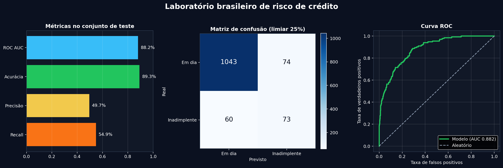
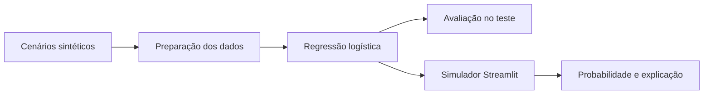

# Laboratório de Risco de Crédito

[](https://www.python.org/)
[](https://streamlit.io/)
[](https://scikit-learn.org/)
[](tests/)
[](LICENSE)

Aplicação interativa de Machine Learning para explorar risco de crédito em um cenário brasileiro. O usuário informa renda, valor solicitado, prazo, taxa mensal, score, atrasos e reserva financeira; o modelo estima a probabilidade de inadimplência e explica os principais fatores do resultado.



## O que o projeto entrega

- simulador com valores em reais e linguagem acessível;
- três cenários prontos para comparação;
- cálculo da parcela pelo Sistema Price;
- probabilidade estimada e faixa de risco;
- explicação local dos fatores que aumentam ou reduzem a estimativa;
- análise de sensibilidade para valor solicitado e score;
- ajuste interativo do limiar de classificação;
- matriz de confusão, curva ROC e métricas explicadas;
- geração reproduzível de dados sintéticos;
- testes automatizados para dados, cálculo, modelo e explicação.

## Resultado do modelo

Na separação estratificada usada pelo projeto, a regressão logística apresentou os resultados abaixo. As métricas de classificação usam limiar de 25%.

| Métrica | Resultado | O que responde |
| --- | ---: | --- |
| ROC AUC | 0,882 | O modelo ordena perfis de menor e maior risco? |
| Acurácia | 89,3% | Quantas classificações foram corretas? |
| Precisão | 49,7% | Entre os sinalizados, quantos eram inadimplentes? |
| Recall | 54,9% | Entre os inadimplentes, quantos foram encontrados? |
| Brier Score | 0,066 | As probabilidades previstas se aproximam dos resultados? |

O aplicativo permite alterar o limiar e observar o efeito sobre precisão, recall e matriz de confusão.

## Dados brasileiros sem falsa equivalência

A versão anterior do projeto usava uma base histórica alemã e valores em marcos alemães. Essa base foi removida.

A nova versão contém 5.000 cenários sintéticos com valores em reais e variáveis familiares ao mercado brasileiro. A escolha é intencional: não há cadastros reais no repositório, e os dados podem ser recriados com a mesma semente.

As relações usadas na geração estão documentadas em [docs/dados_e_metodologia.md](docs/dados_e_metodologia.md). A base serve para demonstrar o fluxo técnico e não representa uma carteira de crédito brasileira.

## Fluxo do projeto



## Estrutura

```text
.
├── app.py
├── assets/
│   └── avaliacao_modelo.png
├── data/
│   └── clientes_credito_sinteticos.csv
├── docs/
│   ├── dados_e_metodologia.md
│   └── linkedin.md
├── scripts/
│   ├── gerar_dados.py
│   └── gerar_visualizacoes.py
├── src/
│   ├── data.py
│   └── model.py
├── tests/
├── train.py
└── requirements.txt
```

## Como executar

```bash
python3 -m venv .venv
source .venv/bin/activate
python -m pip install -r requirements.txt
python -m streamlit run app.py
```

No Windows, ative o ambiente com `.venv\Scripts\activate`.

## Reproduzir os dados e resultados

```bash
python -m scripts.gerar_dados
python -m scripts.gerar_visualizacoes
python -m pytest -q
```

Para treinar e salvar uma cópia do pipeline:

```bash
python train.py
```

## Decisões de modelagem

- regressão logística para manter o comportamento interpretável;
- one-hot encoding nas categorias e padronização nas variáveis numéricas;
- separação estratificada entre treino e teste;
- explicação local calculada a partir das contribuições do próprio modelo;
- ausência de atributos sensíveis como sexo, raça, região e estado civil;
- análise de sensibilidade apresentada como associação, não causalidade.

## Limites de uso

Este é um projeto de portfólio. A base é sintética e as probabilidades não foram calibradas em uma instituição financeira. O aplicativo não aprova, reprova, recomenda ou precifica crédito. Uma aplicação real exigiria dados representativos, validação externa e temporal, governança, monitoramento de deriva e auditoria de equidade.

## Autor

Bruno Nunes — estudante de Ciência de Dados e Inteligência Artificial.
